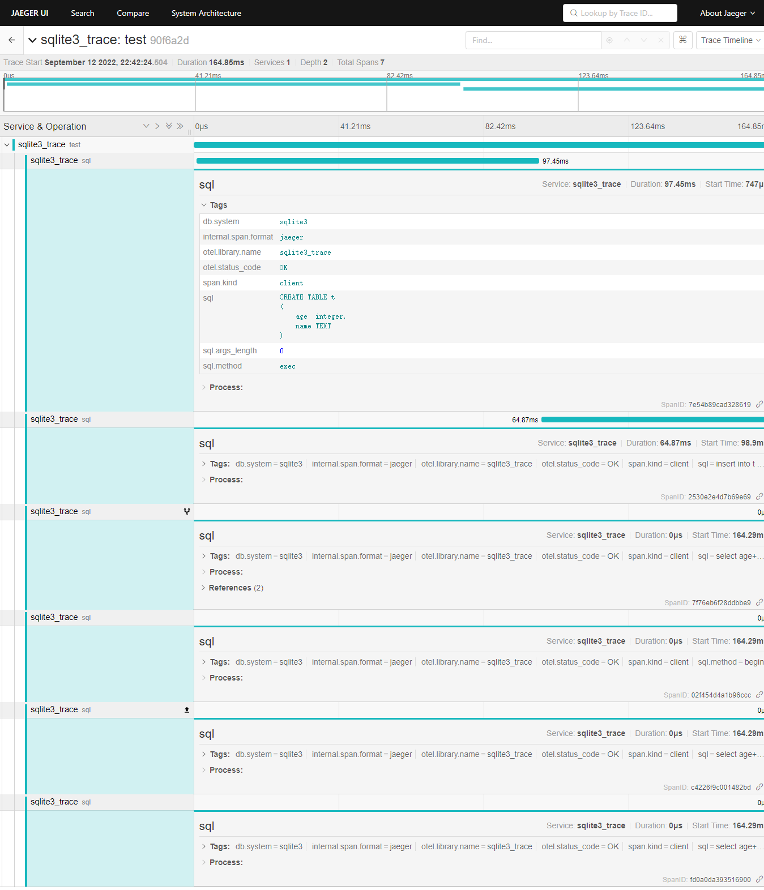

# sqlbreaker

A low-code intrusion SQL breaker library, suitable for any relational database (Sqlite3, MySQL, Oracle, SQL Server,
PostgreSQL, TiDB, etc.) and ORM libraries for various relational database (gorm, xorm, sqlx, etc.)

# 😜installation

```shell
go get -u github.com/chenquan/sqlbreaker
```

# 👏how to use


```go
package main

import (
	"context"
	"database/sql"
	"fmt"

	"github.com/chenquan/sqlbreaker"
	"github.com/chenquan/sqlbreaker/pkg/breaker"
	"github.com/chenquan/sqlplus"
	"github.com/chenquan/sqltrace"
	"github.com/mattn/go-sqlite3"
	"go.opentelemetry.io/otel"
	"go.opentelemetry.io/otel/trace"
)

func main() {
	// Create a sqlite3 driver with tracing and  breaker
	hook := sqlplus.NewMultiHook(
		sqltrace.NewTraceHook(sqltrace.Config{
			Name:           "sqlite3_trace",
			DataSourceName: "sqlite3",
			Endpoint:       "http://localhost:14268/api/traces",
			Sampler:        1,
			Batcher:        "jaeger",
		}),
		sqlbreaker.NewBreakerHook(breaker.NewBreaker()),
	)

	// register new driver
	sql.Register("sqlite3_trace", sqlplus.New(&sqlite3.SQLiteDriver{}, hook))
	defer sqltrace.StopAgent()

	// open database
	db, err := sql.Open("sqlite3_trace", "identifier.sqlite")
	if err != nil {
		panic(err)
	}

	tracer := otel.GetTracerProvider().Tracer("sqlite3_trace")
	ctx, span := tracer.Start(context.Background(),
		"test",
		trace.WithSpanKind(trace.SpanKindClient),
	)
	defer span.End()

	db.ExecContext(ctx, `CREATE TABLE  IF NOT EXISTS t
(
    age  integer,
    name TEXT
)`)
	db.ExecContext(ctx, "insert into t values (?,?)", 1, "chenquan")

	// transaction
	tx, err := db.BeginTx(ctx, nil)
	stmt, err := tx.PrepareContext(ctx, "select age+1 as age,name from t where age = ?;")
	stmt.QueryContext(ctx, 1)
	tx.Commit()

	rows, err := db.QueryContext(ctx, "select  age+1 as age,name from t;")
	for rows.Next() {
		var age int
		var name string
		err := rows.Scan(&age, &name)
		if err != nil {
			fmt.Println(err)
		}

		fmt.Println(age, name)
	}
}

```



# ⭐star
If you like or are using this project to learn or start your solution, please give it a star⭐. Thanks!

# 👐Associated project
- [sqltrace](github.com/chenquan/sqltrace): A low-code intrusion SQL tracing library, suitable for any relational database (Sqlite3, MySQL, Oracle, SQL Server,
  PostgreSQL, TiDB, etc.) and ORM libraries for various relational database (gorm, xorm, sqlx, etc.)
- [sqlplus](github.com/chenquan/sqlplus): A sql enhancement tool library based on database/sql/driver